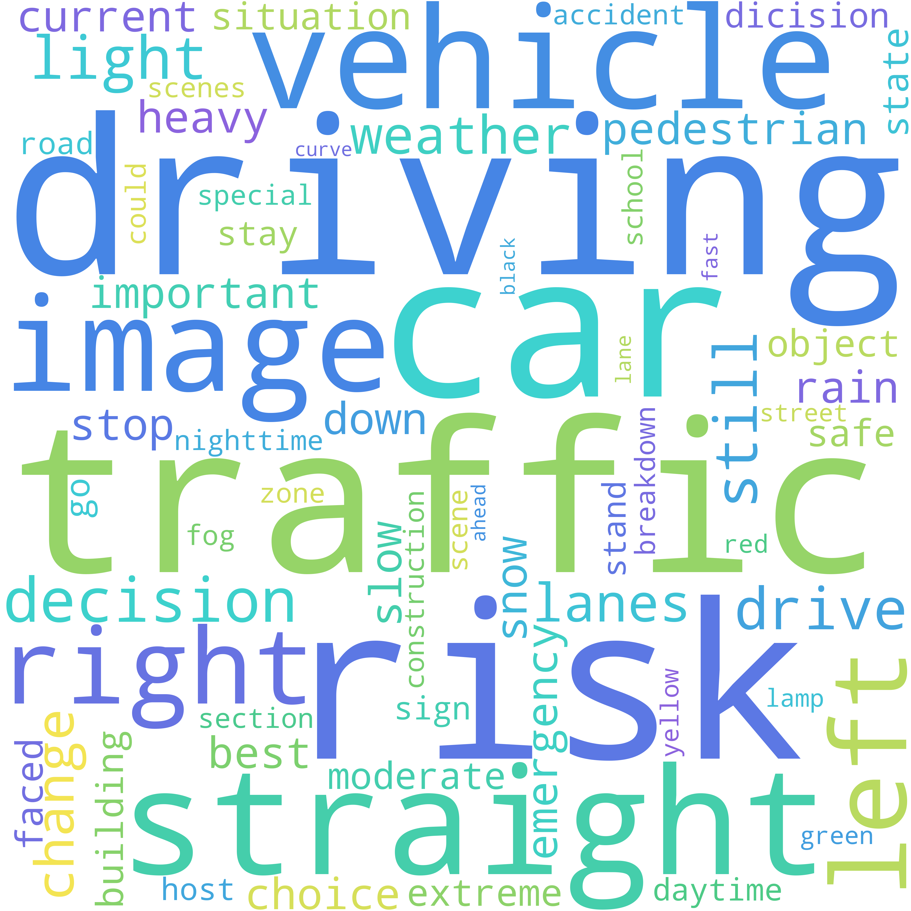
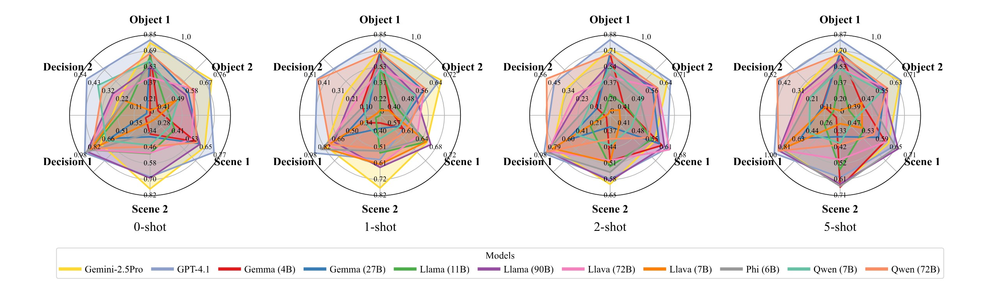
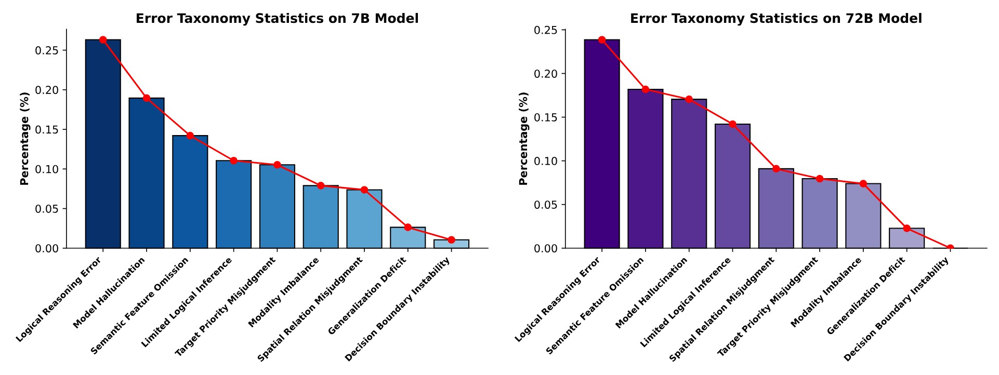
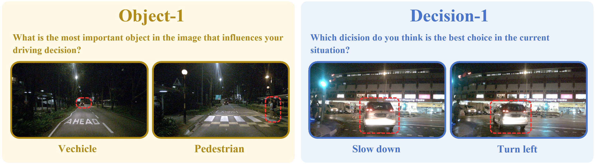

<p align="right"><a href="./README.md">English</a> | 简体中文</p>

<div align="center">

# AutoDriDM：面向自动驾驶 VLM 决策能力的可解释评测基准

**唐泽聪<sup>1,\*</sup>，王紫旭<sup>1,\*</sup>，王翌飞<sup>1,\*</sup>，连伟童<sup>1,\*</sup>，高天健<sup>1</sup>，李灏然<sup>1</sup>，茹腾驹<sup>1</sup>，孟令祎<sup>1</sup>，崔哲珺<sup>1</sup>，朱奕辰<sup>1</sup>，康祺<sup>1</sup>，王开炫<sup>2</sup>，张宇<sup>1,†</sup>**

<sup>1</sup>浙江大学，中国·杭州 &nbsp;&nbsp; <sup>2</sup>香港大学，中国·香港  
<sup>*</sup>共同一作 &nbsp;&nbsp; <sup>†</sup>通讯作者

[](https://arxiv.org/abs/2601.14702)
[](https://huggingface.co/datasets/ColamentosZJU/AutoDriDM)


</div>

自动驾驶是一个高度具有挑战性的领域，需要在复杂场景中实现可靠感知与安全决策。近期的视觉语言模型（VLMs）展现出较强的推理与泛化能力，为自动驾驶带来了新的可能性；然而，现有基准与评测指标往往过度强调感知能力，未能充分评估决策过程。在本文中，我们提出 **AutoDriDM**：一个以决策为中心、渐进式的基准数据集，包含 6,650 个问题，覆盖 **目标（Object）**、**场景（Scene）** 与 **决策（Decision）** 三个维度。我们评测了多种主流 VLM，以刻画其在自动驾驶中从感知到决策的能力边界；相关性分析表明，感知表现与决策表现之间的对齐程度较弱。我们进一步对模型的推理过程开展可解释性分析，识别出以逻辑推理错误等为代表的关键失效模式，并引入一个分析器模型以实现大规模自动标注。AutoDriDM 弥合了以感知为中心与以决策为中心评估之间的鸿沟，为构建更安全、更可靠、可用于真实自动驾驶场景的 VLM 提供了指导。


---

## ✨ 简介

**AutoDriDM** 是一个**以决策为中心（decision-centric）**、具备**渐进式评测（progressive）**设计的自动驾驶 VLM 基准，用于刻画模型从 **感知 → 场景理解 → 决策** 的能力边界，并支持可解释分析与错误模式统计。

### 核心信息

- **评测协议：** 三阶段渐进 —— **Object → Scene → Decision**
- **任务数量：** 6 个任务（每阶段 2 个）
- **规模：** 基于 **1,295** 张前视图像构建 **6,650** 条 QA
- **风险分层：** 每条样本包含五级风险标注 `danger_score ∈ {1,2,3,4,5}`  
  - 可将 **高风险** 定义为 `平均 danger_score ≥ 4.0`
- **可解释性：** 提供推理链分析、错误类别体系，并引入 analyzer 模型用于自动化大规模标注

---

## 🧩 基准结构

AutoDriDM 采用**渐进式评测**：

- **Object Level：** 关键目标/状态感知  
- **Scene Level：** 全局场景理解与关键上下文因素识别  
- **Decision Level：** 驾驶动作选择与风险评估  

---

## 📦 数据集

数据集托管在 Hugging Face：

- https://huggingface.co/datasets/ColamentosZJU/AutoDriDM

包含 **6 个 JSON 文件**，对应 6 个任务：

### Object Level（单选）

- **Object-1 (`Object-1.json`)**：识别影响决策的**最关键目标**。
- **Object-2 (`Object-2.json`)**：判断指定目标的**状态**（如红绿灯状态）。

### Scene Level（多选）

- **Scene-1 (`Scene-1.json`)**：识别**天气/光照**（如白天、夜晚、雨雪、浓雾）。
- **Scene-2 (`Scene-2.json`)**：识别可能影响决策的**特殊场景因素**（如事故、施工等）。

### Decision Level（单选）

- **Decision-1 (`Decision-1.json`)**：选择主车在当前场景下的**最优驾驶动作**。
- **Decision-2 (`Decision-2.json`)**：评估某个指定（可能不优）动作的**风险等级**。

---

## 🧾 数据格式

每个 JSON 文件是一个数组，每个元素包含：

- `image_name`：图像路径/标识
- `taskX_q`：问题
- `taskX_o`：选项字符串（如 `"A....; B....; C...."`）
- `taskX_a`：答案字母  
  - 单选：`"C"`  
  - 多选：`"A,C"`
- `danger_score`：风险等级（1=低风险，5=高风险）

### 示例（JSON）

```json
{
  "image_name": "images/xxxx.jpg",
  "task1_q": "...",
  "task1_o": "A....; B....; C....",
  "task1_a": "C",
  "danger_score": "2"
}
```

---

## 📊 结果与分析图示

### 词云分布

<p align="center">
  <br/>
  <em>从 AutoDriDM QA 文本中统计得到的词云。</em>
</p>

### 雷达图：整体表现

<p align="center">
  <br/>
  <em>各模型在全任务上的整体雷达图表现。</em>
</p>

### 雷达图：高风险场景表现

<p align="center">
  <br/>
  <em>高风险（high danger）场景下的雷达图表现。</em>
</p>

### 错误类别统计

<p align="center">
  <br/>
  <em>可解释性分析的错误类别统计分布。</em>
</p>

### 相似场景鲁棒性示例

<p align="center">
  <br/>
  <em>用于鲁棒性评测的相似场景对示例。</em>
</p>

### 可解释性分析案例

<p align="center">
  <br/>
  <em>代表性的可解释性分析案例展示。</em>
</p>

---

## 🚀 快速开始

### 1）下载标注文件

从 Hugging Face 获取 6 个 JSON 文件：

- https://huggingface.co/datasets/ColamentosZJU/AutoDriDM

### 2）Python 读取示例

```python
import json

with open("Object-1.json", "r", encoding="utf-8") as f:
    data = json.load(f)

print(len(data), list(data[0].keys()))
```

---

## 📌 引用

```bibtex
@article{tang2026autodridm,
  title={AutoDriDM: An Explainable Benchmark for Decision-Making of Vision-Language Models in Autonomous Driving},
  author={Tang, Zecong and Wang, Zixu and Wang, Yifei and Lian, Weitong and Gao, Tianjian and Li, Haoran and Ru, Tengju and Meng, Lingyi and Cui, Zhejun and Zhu, Yichen and Kang, Qi and Wang, Kaixuan and Zhang, Yu},
  journal={arXiv preprint arXiv:2601.14702},
  year={2026}
}
```

---

## ⚖️ 许可证

本项目基于 **Apache License 2.0** 开源发布。  
仓库中可能包含部分第三方组件或实现，其许可证可能与本项目不同。  

---

## 🙏 致谢

感谢开源社区与数据集提供方（nuScenes、KITTI、BDD100K）对本研究的支持。
